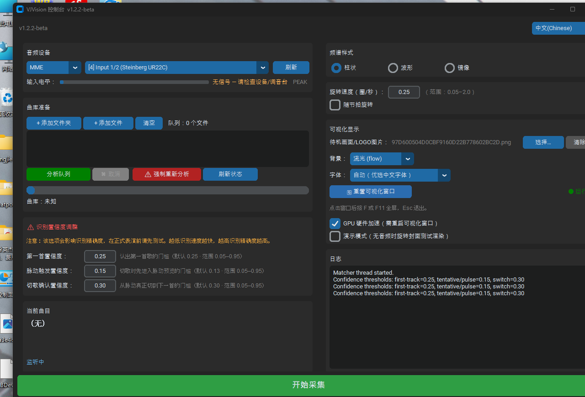
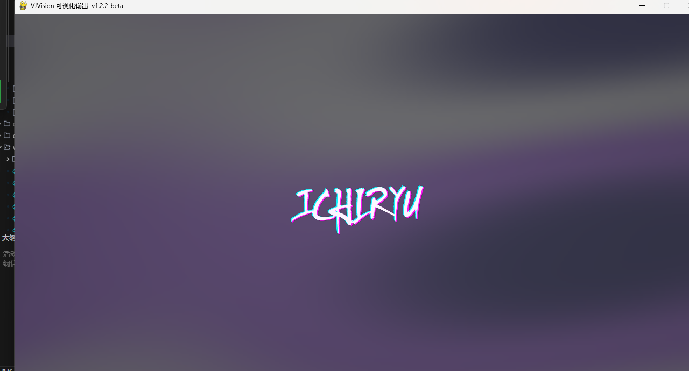

# VJVision

> 实时音频识别 + 音频响应可视化，专为 DJ 现场设计。
> Real-time audio recognition + audio-reactive visualizer for DJ live sets.

VJVision 监听 DJ 台的输出音频，自动识别当前播放的曲目，在副屏（投影 / LED 墙）渲染随音乐律动的频谱与专辑封面动画。
VJVision listens to the DJ booth output, auto-recognises the playing track, and renders a music-reactive spectrum + cover animation on a second display (projector / LED wall).

---

## 界面预览 / Screenshots

| 控制台（主屏）/ Console (primary display) | 可视化输出（副屏待机画面）/ Visualizer (secondary, standby) |
|---|---|
|  |  |

## 功能 / Features

- **自动曲目识别**：Dejavu 声学指纹，12 秒采样窗口实时识别 / **Automatic recognition** — Dejavu acoustic fingerprints, 12 s sampling window
- **音频响应可视化**：柱状 / 波形 / 镜像频谱，封面随节拍旋转 / **Audio-reactive visuals** — bar / wave / mirror spectrum; cover spins with the beat
- **GPU 硬件加速**：SDL2 GPU 渲染 + 垂直同步，全屏不撕裂、高分辨率屏稳定 60fps，失败自动回退软件渲染 / **GPU acceleration** — SDL2 + vsync, tear-free fullscreen, steady 60 fps; automatic software fallback
- **混音过渡脉动**：检测切歌 / cross-fade 时画面脉动，平滑过渡到下一首 / **Mix-transition pulse** — pulses on cross-fades for a smooth switch
- **中英双语界面**：右上角一键切换 / **Bilingual UI** — switch 中文 / English from the top-right
- **多显示器**：控制台在主屏，可视化自动投副屏 / **Multi-display** — console on primary, visualizer on the secondary screen
- **便携部署**：单个 exe / app + `data/` 文件夹拷走即用，指纹库与全部设置随行 / **Portable** — one exe/app plus a `data/` folder; fingerprint DB and all settings travel with it

## 系统要求 / Requirements

| 项目 Item | 要求 Requirement |
|------|------|
| 操作系统 OS | Windows 10 / 11（exe）；macOS 11+，Intel 与 Apple Silicon 均提供 DMG / DMGs for both Intel & Apple Silicon |
| 运行依赖 Runtime | 无需安装 Python 或任何解码器（ffmpeg 已内置）/ No Python or codec install needed (ffmpeg bundled) |
| 源码开发 Dev | Python 3.13+；macOS 需先 `brew install portaudio` |
| 音频输入 Audio | Windows：声卡 / 虚拟音频线（WASAPI / DirectSound / MME）；macOS：USB 声卡 / 麦克风直连可用，内录系统声音需 BlackHole（见下文） |
| 显示器 Displays | 至少 1 块；推荐 2 块（控制 + 投影）/ 1 minimum; 2 recommended |

## 下载安装 / Download & Install

**Windows**
1. 从 [Releases](https://github.com/ichiryu0021/VJVision/releases) 下载 `VJVision.exe`，双击运行。
   Download `VJVision.exe` from [Releases](https://github.com/ichiryu0021/VJVision/releases) and double-click.
2. 首次启动在 exe 同级目录生成 `data/`（指纹库、设置、日志）。
   First launch creates a `data/` folder next to the exe (DB, settings, log).

**macOS**
1. 从 [Releases](https://github.com/ichiryu0021/VJVision/releases) 按芯片下载 DMG：M 系列芯片 → `VJVision-macos-arm64.dmg`；Intel → `VJVision-macos-x86_64.dmg`。
   Download the DMG matching your Mac: Apple Silicon → `VJVision-macos-arm64.dmg`; Intel → `VJVision-macos-x86_64.dmg`.
2. 打开 DMG，把 **VJVision** 拖入「应用程序 / Applications」。首次启动请**右键 → 打开**（应用未签名，双击会被 Gatekeeper 拦截，右键打开一次后正常）。
   Drag **VJVision** to Applications. First launch: **right-click → Open** (unsigned app; double-click is blocked by Gatekeeper until opened once via right-click).
3. 首次运行在 `VJVision.app` 同级目录生成 `data/`。
   First launch creates a `data/` folder next to `VJVision.app`.
4. **识别电脑自己播放的声音**：macOS 无系统内录 API，需安装一次免费开源的 [BlackHole](https://existential.audio/blackhole/) 虚拟声卡（`brew install --cask blackhole-2ch`），在「音频 MIDI 设置」建多输出设备（耳机 + BlackHole 同时出声），再在 VJVision 设备下拉选 BlackHole。USB 声卡 / 麦克风 / 线路输入无需额外安装，直接选择；首次采集时请允许系统弹出的**麦克风权限**。
   **To capture the Mac's own audio**: install the free [BlackHole](https://existential.audio/blackhole/) virtual driver once, create a Multi-Output Device (headphones + BlackHole) in Audio MIDI Setup, then pick BlackHole in VJVision. USB soundcards / mics / line-in work directly. Allow the **Microphone permission** prompt on first capture.

## 使用说明 / Usage Guide

控制台分区（见上图）/ Console layout (see screenshot above)：

| 区域 Region | 内容 Contents |
|---|---|
| 左上 音频设备 | 驱动类型、设备下拉、刷新、输入电平表（PEAK 削波指示）/ Driver, device dropdown, refresh, input level meter with PEAK clip indicator |
| 左中 曲库准备 | 添加文件夹 / 文件、分析队列、强制重新分析、进度条 / Add folder/files, analyze queue, force re-analyze, progress |
| 左下 识别置信度 | 三道识别阈值高级调节（默认值见下表）/ Three confidence gates (advanced; defaults below) |
| 右上 频谱样式 | 柱状 / 波形 / 镜像、旋转速度、随节拍旋转 / Bar / wave / mirror, rotation speed, beat-reactive |
| 右中 可视化显示 | 待机 LOGO、背景模式、字体、GPU 加速开关、演示模式、重置窗口 / Standby logo, background, font, GPU toggle, demo mode, reset window |
| 右下 日志 | 识别结果、分析进度、错误信息 / Recognition results, analysis progress, errors |
| 底部整条 | **开始采集 / 停止采集** 大按钮（绿 = 待机，红 = 采集中）/ **Start / Stop Capture** bar (green = idle, red = running) |

**标准流程 / Standard workflow**

1. **添加曲库 / Add the library** — 点「+ 添加文件夹」选择音乐目录（支持 `.flac` `.wav` `.mp3` `.aiff` `.aif` `.ogg`），点「分析队列」生成指纹。首次较慢（约 3–4 秒/首），之后增量；损坏音频自动用内置 ffmpeg 容错解码。
   Click **+ Add Folder**, then **Analyze Queue** to fingerprint the library. First run is slow (~3–4 s/track), later runs are incremental; corrupt files fall back to the bundled ffmpeg decoder automatically.
2. **选择音频设备 / Pick the audio device** — 在下拉框选择监听 DJ 输出的设备（声卡输入或虚拟音频线），说话/放音时电平表应有跳动；显示 PEAK 说明音量过大。
   Select the device monitoring the DJ output (soundcard input or virtual cable). The level meter should move; PEAK means the signal is clipping — lower the source volume.
3. **调整可视化 / Tune the visualizer** — 可视化窗口默认投到**第 2 块屏幕**（如需改到其他屏幕，编辑 `data/prefs.json` 里的 `"visualizer_display"`，0 = 主屏）。可选频谱样式、旋转速度、上传待机 LOGO（识别出第一首歌前显示）、背景模式；「GPU 硬件加速」建议保持勾选。
   The visualizer opens on the **2nd display** by default (to change it, edit `"visualizer_display"` in `data/prefs.json`; 0 = primary). Pick spectrum style, rotation speed, upload a standby LOGO (shown before the first track), and background mode. Keep **GPU acceleration** enabled.
4. **开始 / Start** — 点底部「开始采集」，副屏出现可视化；播放音乐，几秒内自动识别并显示封面。切歌时画面脉动过渡。点击可视化窗口后按 **F / F11** 全屏（原生分辨率），**Esc** 退出。
   Click **Start Capture** — the visualizer appears on the secondary screen; playback is recognised within seconds with cover art. Cross-fades trigger the pulse transition. Click the visualizer window and press **F / F11** for native-resolution fullscreen, **Esc** to exit.
5. **演示模式 / Demo mode** — 无音频输入时勾选「演示模式」，窗口旋转随机封面，用于提前测试渲染效果。
   With no audio input, tick **Demo mode** to rotate random covers and test the render ahead of time.

**便携迁移 / Portable migration** — 在 A 电脑分析完曲库后，把 `VJVision.exe`（或 `.app`）连同 `data/` 文件夹一起拷到 U 盘 / B 电脑，所有指纹、封面缓存、设置直接生效，无需重新分析。注：音频设备索引与本机声卡相关，换电脑后可能需要在下拉框重选一次。
After analysing on PC A, copy the exe/app **together with the `data/` folder** to a USB stick / PC B — fingerprints, cover cache and all settings carry over, no re-analysis needed. Note: the audio-device index refers to the local sound card, so re-pick it in the dropdown on a different machine.

## 从源码运行 / Run from Source

```bash
git clone https://github.com/ichiryu0021/VJVision.git
cd VJVision
pip install -r requirements.txt
python main.py        # macOS 需先 / macOS first: brew install portaudio
```

## 打包 / Build

```bash
pip install pyinstaller
python -m PyInstaller VJVision.spec --noconfirm --clean
# Windows → dist/VJVision.exe ；macOS → dist/VJVision.app
```

macOS 打成 DMG / Package a DMG on macOS:

```bash
hdiutil create -volname VJVision -srcfolder dist/VJVision.app -ov -format UDZO VJVision-macos.dmg
```

> macOS 的 DMG 由 GitHub Actions 自动构建：推送 `v*` 标签后，云端 Mac（Intel + Apple Silicon）自动打包并上传到对应 Release，无需本地有 Mac。
> macOS DMGs are built automatically by GitHub Actions: pushing a `v*` tag builds on cloud Macs (Intel + Apple Silicon) and uploads both DMGs to the Release — no local Mac required.

## 数据目录 / Data Directories

全部位于便携的 `data/` 文件夹内（macOS 为 `.app` 同级目录）/ All inside the portable `data/` folder (next to the `.app` on macOS):

| 文件 File | 内容 Contents |
|------|------|
| `fingerprints.db` | 音频指纹库（SQLite）/ Fingerprint DB |
| `song_paths.sqlite` | 歌曲 ID → 文件路径索引 / Song ID → file path index |
| `covers/` | 专辑封面缓存 / Album cover cache |
| `prefs.json` | 全部设置：音频设备、显示器、语言、置信度阈值、可视化选项 / All settings: device, display, language, confidence gates, visual options |
| `vjvision.log` | 运行日志（排查问题先看它）/ Runtime log (check this first when troubleshooting) |

## 识别参数 / Recognition Tunables

控制台左下「识别置信度调整」面板可直接调，自动保存到 `prefs.json`；也可改 `vjvision/config.py` 的 `CaptureConfig` 默认值。
Tune live in the console's red **Recognition Confidence** panel (auto-saved to `prefs.json`), or edit the `CaptureConfig` defaults in `vjvision/config.py`.

| 参数 Param | 默认 Default | 说明 Description |
|------|--------|------|
| 第一首置信度 First-track | 0.25 | 认出第一首歌的门槛 / Floor to accept the first track |
| 脉动触发置信度 Pulse-trigger | 0.13 | 切歌时进入脉动预览的门槛；越低越灵敏、越高越防误触 / Floor to start the pulse preview; lower = faster, higher = fewer false triggers |
| 切歌确认置信度 Switch-confirm | 0.30 | 从脉动预览真正切到下一首的门槛 / Floor to confirm the switch |
| `match_seconds` | 12 | 每次采样时长（秒）/ Sampling window (s) |
| `match_interval` | 4 | 识别间隔（秒），混音期自动减半 / Recognition interval (s); auto-halved during mixes |
| `match_confirmations` | 2 | 连续命中几次才切歌 / Consecutive hits required to switch |

## 常见问题 / FAQ

**识别不到歌曲？/ Recognition fails?**
看输入电平表是否有信号 → 确认歌曲已分析 → 看 `data/vjvision.log` 的置信度（低于 0.25 多为音量过低 / 音质差）。
Check the level meter for signal → confirm the track was analysed → check confidence in `data/vjvision.log` (below 0.25 usually means too quiet / poor quality).

**不支持 m4a / aac？/ m4a / aac not supported?**
解码基于 libsndfile，不原生支持 m4a/aac，请转成 flac / mp3 后分析。
Decoding uses libsndfile; m4a/aac are not natively supported — convert to flac / mp3 first.

**下载的歌曲分析失败？/ A downloaded track fails analysis?**
v1.2.1+ 内置 ffmpeg 容错解码，坏帧自动跳过（日志标注 `Recovered via ffmpeg fallback`），无需自行安装 ffmpeg；失败文件还会在分析结束后以单线程低内存模式自动重试一次。
v1.2.1+ bundles ffmpeg tolerant decoding — broken frames are skipped automatically (logged as `Recovered via ffmpeg fallback`); failed files also get one automatic single-worker low-memory retry after the parallel pass.

**没有声卡 / 启动闪退？/ No sound card / startup crash?**
无音频设备时会给出明确中文提示，可视化与曲库分析照常可用；运行中拔出设备也不会崩溃。
With no audio device a clear message is shown and the visualizer / library analysis still work; unplugging a device mid-run is safe.

**macOS 设备列表为空？/ Empty device list on macOS?**
到「系统设置 → 隐私与安全性 → 麦克风」允许 VJVision（BlackHole 等虚拟设备走同一权限）。
Allow VJVision in System Settings → Privacy & Security → Microphone (virtual devices like BlackHole use the same permission).

**关闭控制台后可视化窗口残留？/ Visualizer stays open after closing the console?**
v1.1.1+ 已修复：子进程检测父进程退出后自动关闭。
Fixed in v1.1.1+: the visualizer child exits automatically when the parent console closes.

## 技术架构 / Architecture

```
main.py
├── VisualizerManager → pygame 子进程（副屏可视化，SDL2 GPU 渲染）/ pygame subprocess (secondary display, SDL2 GPU)
├── MatcherThread    → 音频采集 + Dejavu 指纹识别 + 元数据 / audio capture + Dejavu recognition + metadata
└── DebugUI          → CustomTkinter 控制面板（主线程）/ CustomTkinter control panel (main thread)
```

- 进程间通信 IPC：`multiprocessing.Queue`；指纹算法 Fingerprinting：Dejavu（声学指纹 + 哈希匹配）
- 音频解码 Decoding：soundfile（libsndfile，24-bit FLAC）+ 内置 ffmpeg 兜底 / bundled ffmpeg fallback
- 国际化 i18n：`vjvision/i18n.py`（中英双语）

## 许可证 / License

MIT（开源且**必须署名**）— 使用、复制、修改、分发时须保留原始版权声明与许可证全文，详见 [LICENSE](LICENSE)。
MIT (open source, **attribution required**) — retain the copyright notice and license text when using, copying, modifying or distributing. See [LICENSE](LICENSE).

第三方依赖 / Third-party licenses：sounddevice (MIT) · soundfile (BSD-3) · numpy (BSD-3) · dejavu (MIT) · pygame-ce (LGPL-2.1) · customtkinter (MIT) · Pillow (HPND) · mysql-connector-python (GPLv2 + FOSS Exception) · mutagen (GPLv2+)。

> 注意：`mutagen` 为 GPLv2+，分发时须同时遵守其条款。
> Note: `mutagen` is GPLv2+; comply with its terms when redistributing.

## 版本历史 / Changelog

见 [RELEASE_NOTES.md](RELEASE_NOTES.md) / See [RELEASE_NOTES.md](RELEASE_NOTES.md).
