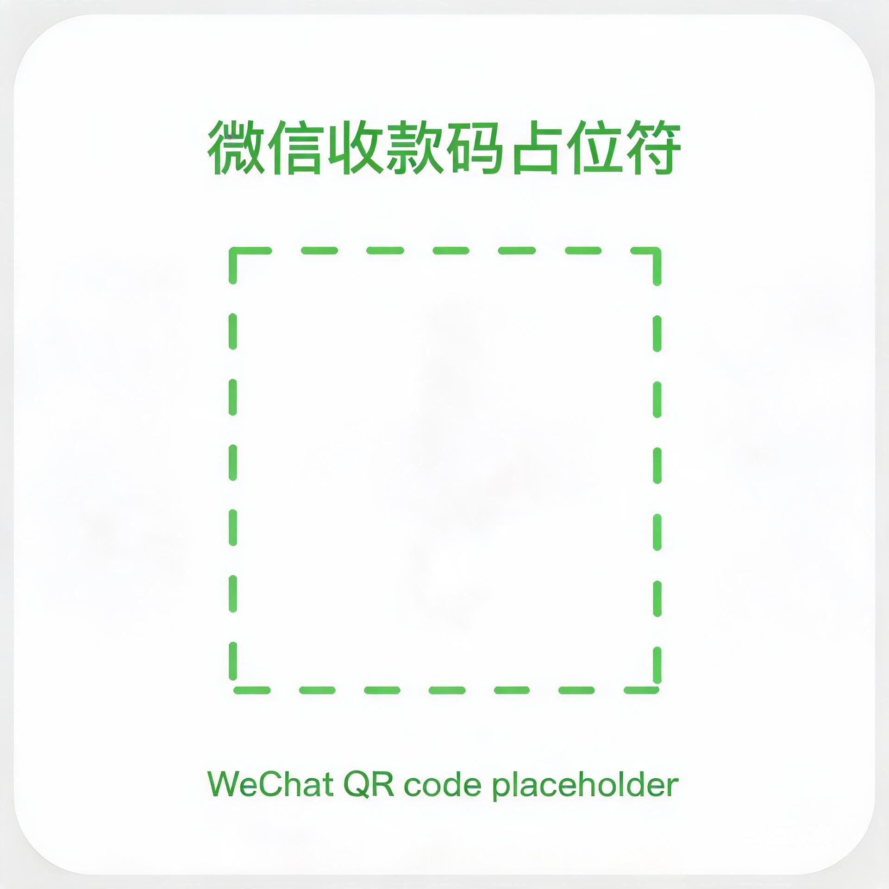

<div align="center">

# VJVision 2.0

**实时音频识别 + 音频响应可视化，专为 DJ 现场设计**
<br>*Real-time audio recognition + audio-reactive visualizer for DJ live sets.*

[](https://github.com/ichiryu0021/VJVision/releases/latest)
[](LICENSE)
[](https://github.com/ichiryu0021/VJVision/stargazers)
[](https://github.com/ichiryu0021/VJVision)

[**下载最新版**](https://github.com/ichiryu0021/VJVision/releases/latest) · [**快速开始**](#快速开始--quick-start) · [**构建源码**](#从源码构建--build-from-source)

</div>

---

<div align="center">

### 💖 支持项目 / Support

如果 VJVision 帮到了你，欢迎赞赏支持，让项目持续迭代。
<br>*If VJVision has helped you, consider sponsoring to keep it evolving.*


<br>
<small>微信赞赏码 / WeChat sponsor code</small>

</div>

---

## 目录 / Table of Contents

- [简介 / Introduction](#简介--introduction)
- [功能 / Features](#功能--features)
- [系统要求 / Requirements](#系统要求--requirements)
- [快速开始 / Quick Start](#快速开始--quick-start)
- [数据目录 / Data Folder](#数据目录--data-folder)
- [控制台分区 / Console Layout](#控制台分区--console-layout)
- [可视化快捷键 / Visualizer Shortcuts](#可视化快捷键--visualizer-shortcuts)
- [从源码构建 / Build from Source](#从源码构建--build-from-source)
- [音乐电池引擎 / Music Battery Engine](#音乐电池引擎--music-battery-engine)
- [常见问题 / FAQ](#常见问题--faq)
- [技术架构 / Architecture](#技术架构--architecture)
- [版本历史 / Changelog](#版本历史--changelog)
- [许可证 / License](#许可证--license)

---

## 简介 / Introduction

VJVision 监听 DJ 台的输出音频，自动识别当前播放的曲目，渲染随音乐律动的频谱、封面动画与粒子波纹。

VJVision listens to the DJ booth output, auto-recognises the playing track, and renders a music-reactive spectrum, cover animation and particle ripple.

---

## 功能 / Features

| 功能 Feature | 说明 Description |
|---|---|
| 🎵 **自动曲目识别** | 声学指纹（FFT → 峰值 → 哈希 → SQLite 索引），12 秒采样窗口实时识别 / Acoustic fingerprint, 12 s sampling window |
| ⚡ **C++ 重写** | 全栈 C++17 + Qt 6，比 Python V1 启动快 10×、内存占用低 60% / C++17 + Qt 6; 10× faster startup, 60% less memory |
| 🎮 **GPU 硬件加速** | Qt Quick Scene Graph（OpenGL/Vulkan 自动选择），60fps 高分辨率稳定渲染 / Qt Quick Scene Graph, steady 60 fps |
| 🌊 **音频响应可视化** | 柱状 / 镜像 / 放射 / 瀑布频谱、粒子波纹、封面随节拍脉冲 / Bar, mirror, radial, waterfall spectrum, particle ripple, cover pulse |
| 🖼️ **待机 LOGO 自定义** | 支持 PNG/JPG/GIF（透明通道保留、自动循环动画）/ PNG/JPG/GIF with alpha and auto-loop |
| 🎬 **背景媒体自定义** | 纯色 / GIF / WEBP / MP4 / MOV / MKV，PreserveAspectCrop 填满屏幕无黑边 / Solid, GIF, video backgrounds, edge-cropped fill |
| 🖥️ **多显示器支持** | 默认窗口化，拖到任意屏幕按 `F` 全屏 / Windowed by default, press `F` for fullscreen on any display |
| 🗃️ **无 DB 也能跑** | 没有指纹库时仅渲染频谱与波形（standby-only 模式）/ Spectrum + ripple only when no fingerprint DB |
| 🌐 **中英双语界面** | 一键切换 中文 / English / One-click Chinese / English switch |
| 🔗 **声卡稳定锁定** | 按系统设备 ID 记忆录音设备，重启、插拔声卡、枚举顺序变化均不漂移；设备缺失自动回退默认回采 / Remembers the recording device by stable system ID across reboots and replugging; auto-falls back if missing |
| 🔋 **音乐电池引擎** | 漏桶决策状态机：控制面板实时显示当前 / 候选曲目的 0–10 确认电量与识别事件；空槽首曲跨时间复核防误开场，混音重叠期保持不抖屏（详见[音乐电池引擎](#音乐电池引擎--music-battery-engine)）/ Leaky-bucket decision state machine with live 0–10 charge bars and events; cross-time first-track gate and flicker-free mix hold |
| 🛡️ **开场防误触** | 空槽第一首需跨时间复核才确认，环境噪声与巧合匹配不再误报；真歌约 2 秒确认 / The first track at an empty slot needs a cross-time re-check, suppressing false openings; real tracks confirm in ~2 s |
| 💾 **便携部署** | exe + Qt 运行库 + 空 `data/` 文件夹拷走即用 / Portable: exe + Qt runtime + empty `data/` folder |

---

## 系统要求 / Requirements

| 项目 Item | 要求 Requirement |
|---|---|
| 操作系统 OS | Windows 10 / 11 x64 |
| CPU | Intel / AMD x64，支持 SSE2（大部分 2010 年后的 CPU） |
| 内存 RAM | 4 GB 起；分析大曲库建议 8 GB+ |
| 显卡 GPU | 支持 OpenGL 3.0 的任意显卡（Qt Quick 自动选择 GL/VK） |
| 音频输入 Audio | WASAPI 回环（推荐，零延迟立体声）/ DirectSound / MME；虚拟音频线（VB-Cable 等）推荐 |
| 存储 Storage | 500 MB（程序 + Qt 运行库）；曲库按每首约 2–3 KB 指纹库扩展 |
| 显示器 Displays | 至少 1 块；2 块推荐（主屏控制台 + 副屏可视化） |

---

## 快速开始 / Quick Start

### 下载 / Download

从 [GitHub Releases](https://github.com/ichiryu0021/VJVision/releases/latest) 下载最新版压缩包，解压到任意位置。

Download the latest release from [GitHub Releases](https://github.com/ichiryu0021/VJVision/releases/latest) and extract it anywhere.

### 目录结构 / Layout

```
VJVision/
├── VJVision.exe           ← 双击运行入口
├── Qt6Core.dll ...        ← Qt 运行库（windeployqt 自动部署）
├── avcodec-61.dll ...     ← FFmpeg（MP4 播放）
├── qml/                   ← QML 插件
├── platforms/             ← Windows 平台插件
├── multimedia/            ← 多媒体后端（WASAPI 捕获 + FFmpeg 解码）
└── data/                  ← 空目录；首次运行自动生成内容
```

### 首次启动 / First Launch

```
1. 双击 VJVision.exe
   控制台打开；data/ 文件夹在 exe 同级自动创建
2. （可选）选择「数据文件夹」→「音乐目录」→ 点「分析」
   生成 VJVision.db 指纹库
3. 选择音频设备（监听 DJ 输出的声卡/虚拟线）
   放音乐时电平表应有跳动
4. 选待机 LOGO（可选 PNG/GIF）和背景（默认/自定义）
5. 点「启动可视化」→ viz 窗口弹出
   拖到任意屏幕，按 F 全屏
```

启动后也可以**跳过分析**，直接看频谱 + 波纹（standby 模式）。
You can also **skip analysis** and enjoy spectrum + ripple visuals right away (standby mode).

---

## 数据目录 / Data Folder

全部位于 `data/` 文件夹内（与 exe 同级，首次运行自动创建）/ All inside `data/` (next to the exe, auto-created on first launch):

| 文件 File | 内容 Contents |
|---|---|
| `VJVision.db` | 音频指纹库（SQLite）— 执行「分析」后生成 / Fingerprint DB (SQLite), created after analysis |
| `VJVision_prefs.json` | 全部设置：音频设备、语言、LOGO、背景、遮罩、可视化选项 / All settings: device, language, logo, background, overlay, visualizer options |
| `covers/` | 专辑封面缓存 / Album cover cache |

> **便携迁移 / Portable migration** — 把整个 `VJVision/` 文件夹（exe + dll + qml + data/）拷到 U 盘或另一台电脑，设置和指纹库完全保留，无需重新分析。音频设备按系统稳定 ID 记忆：同一台电脑上即使插拔声卡或重启也无需重选；仅当目标设备不存在（换机 / 拔出 / 禁用）时才需要重选，期间自动回退默认输出回采。
> Copy the whole `VJVision/` folder to a USB stick or another machine — settings and fingerprints carry over. The audio device is remembered by its stable system ID: no re-picking after replugging or rebooting on the same machine; you only need to re-pick when the target device is genuinely absent (different machine, unplugged, disabled), with automatic fallback to the default output loopback in the meantime.

---

## 控制台分区 / Console Layout

| 区域 Region | 内容 Contents |
|---|---|
| 音频硬件 | 设备下拉 + 刷新 + **输入电平表**（PEAK 削波指示）/ Device dropdown, refresh, **level meter** with PEAK clip indicator |
| 数据 | 数据文件夹、音乐目录、**分析**按钮 + 进度条 + 歌曲数 / Data folder, music folder, **Analyze** button + progress + track count |
| 电量状态 | **音乐电池引擎**常驻状态组：当前 / 候选曲目 0–10 电量条 + 识别事件（候选、确认、混音保持）/ Persistent **Music Battery** group: current / candidate 0–10 bars + recognition events |
| 视觉效果 | 待机 LOGO（浏览 + 清除）、背景来源（默认/自定义）、底色/背景媒体、黑色遮罩深度 / Standby logo, background source, colour or media picker, black overlay depth |
| 识别状态 | 当前歌曲、识别日志、错误信息 / Current track, recognition log, errors |
| 底部整条 | **启动可视化 / 停止** 大按钮 / **Start / Stop Visualizer** bar |

---

## 可视化快捷键 / Visualizer Shortcuts

| 键 Key | 动作 Action |
|---|---|
| `F` | 全屏 ↔ 窗口切换 / Toggle fullscreen ↔ windowed |
| `Esc` | 仅全屏时退出全屏 / Exit fullscreen only |

---

## 从源码构建 / Build from Source

> 💡 **大多数用户不需要编译**：直接从 [Releases](https://github.com/ichiryu0021/VJVision/releases/latest) 下载现成构建（安装版 / 便携版 ZIP），解压或双击即可使用。本节仅供想修改源码的开发者参考。
> 💡 **Most users don't need to build**: grab a ready-made installer or portable ZIP from [Releases](https://github.com/ichiryu0021/VJVision/releases/latest) and run it directly. This section is only for developers who want to modify the source.

**Windows（官方支持）/ Windows (officially supported):**

```powershell
# 前置 / Prerequisites
# - CMake 3.21+
# - Visual Studio 2022 (MSVC v143)
# - Qt 6.8+ with MSVC 2022 64-bit + Multimedia component
#   （用 MaintenanceTool 装 Qt，或 aqtinstall: pip install aqtinstall && aqt install-qt windows desktop 6.8.3 win64_msvc2022_64 -m qtmultimedia）

git clone https://github.com/ichiryu0021/VJVision.git
cd VJprg          # Trae cwd 名；git 仓库相同
cmake -S . -B build -G "Visual Studio 17 2022" -A x64
cmake --build build --config Release

# 产物 / Output: build/Release/VJVision.exe
# 部署 Qt 运行库 / Deploy Qt runtime:
windeployqt --qmldir src/viz/qml build/Release/VJVision.exe
```

---

## 音乐电池引擎 / Music Battery Engine

VJVision 的曲目确认不是“单次匹配取最高分”，而是一个专为 DJ 现场设计的**漏桶决策状态机**——**音乐电池引擎（Music Battery / ChargeBarEngine）**。引擎随项目以 MIT 许可证开源，源码见 [src/engine/charge_engine.cpp](src/engine/charge_engine.cpp)。

Track confirmation in VJVision is not a single-shot "highest score wins" matcher but a **leaky-bucket decision state machine built for DJ live sets** — the **Music Battery engine (ChargeBarEngine)**. It ships under MIT with the rest of VJVision; source at [src/engine/charge_engine.cpp](src/engine/charge_engine.cpp).

### 工作原理 / How It Works

| 概念 Concept | 说明 Description |
|---|---|
| 拍 Beat | 每 0.5 s 识别一拍，每拍对约 4.5 s 的音频切片做指纹，相邻切片重叠约 90% / One recognition tick every 0.5 s over a ~4.5 s slice, ~90% overlap between adjacent slices |
| 槽位 Slot | “正在播放”是一个槽位，任何时刻只放一首歌 / The currently playing track is one slot holding exactly one song at any time |
| 电量条 Bars | 槽内歌与候选歌各有一条 **0–10 格**电量条，控制面板实时显示 / The slotted track and the challenger each own a **0–10 bar**, shown live in the control panel |
| 入场票 Admission | 同一首歌的时间轴对齐票达到 **4 票**才允许进入任何电量条，过滤零散巧合命中 / At least **4 time-aligned votes** for the same song are required to charge a bar |
| 空槽充电 Empty slot | 待机（首曲 / 无信号回待机后）两条都**不漏电**，候选只充不放，第一个充满 10 格的歌取得候选资格 / On standby neither bar leaks; the first candidate to reach 10 bars becomes eligible |
| 首曲跨时间复核 First-track gate | 满格后还需 **≥ 2 个充电拍**，且各拍的播放偏移必须锚定在 **±0.35 s** 内（两次充电之间不限时间）。真歌偏移稳定，约 2 s 过门；巧合误匹配的偏移拍间乱跳，永远凑不齐第二拍 / After 10 bars it needs **≥ 2 charging ticks** whose offsets agree within **±0.35 s** (no time limit between them). A real track passes in ~2 s; coincidental matches drift and never complete the gate |
| 漏电时代 Leak era | 有歌进槽后，每拍**先漏 1 格再进票**，挑战者必须持续跑赢漏电才能换槽 / Once the slot is occupied, both bars **leak 1 bar before charging** each tick; a challenger must out-charge the drain |
| 漏零不退场 Hold at zero | FX、搓碟、EQ 滤波会让指纹暂时归零但歌还在放——槽内歌电量漏到 0 **也不退场**，画面保留，直到下一首充满换槽；回到待机只由“持续无信号”决定 / FX, scratching and EQ kills can zero the fingerprints while the track keeps playing — the slotted track **never exits at zero bars**; visuals hold until the next track fully charges. Standby is entered only on a sustained no-signal timeout |
| 候选锚定 Anchor | 候选只收锁定偏移 ±0.35 s 内的票；连续 **3 拍**漂移则重锚（保留已充电量）；别的歌连续 **4 拍（≈2 s）**抢中则候选换人；进槽后的挑战者 **6 s** 无进票即过期 / A candidate accepts votes only within ±0.35 s of its anchor; **3** drifting ticks re-anchor (charge kept), **4 ticks (~2 s)** of another song transfer the candidacy, and a challenger expires after **6 s** without votes |
| 事件 Events | `候选 Tentative`（脉动预览，不切画面）→ `混音保持 MixHold`（两曲重叠期都有票，画面不抖）→ `确认 Confirmed`（充满换槽切歌）/ Tentative preview → MixHold during blends (no flicker while both tracks score) → Confirmed slot switch |

### 指纹层的抗变速 / Tempo Resilience in the Fingerprints

底层指纹同样为 DJ 操作做了加固：schema v3 对哈希的时间差 / 频率差做量化，**keylock 变速（±2–6% 微调 BPM、音调不变）下哈希仍可对齐**；schema v2 的密集峰值 + 四相位扫描保证慢速淡入段也有足够峰值可投。这让音乐电池引擎在搓碟、EQ 扫频与变速混音中收到的票连续且稳定，而不是只在“干净段落”才工作。

The fingerprints themselves are hardened for DJ use: schema v3 quantises the hash time/frequency deltas so hashes still align under **keylock tempo nudges (±2–6% BPM, pitch unchanged)**, while schema v2's dense peak extraction with a four-phase sweep keeps enough votes during slow fades. The battery therefore charges continuously through scratching, EQ sweeps and tempo mixes instead of only during clean passages.

### 开源与署名 / Open Source & Attribution

引擎刻意**不暴露任何用户可调阈值**——上述全部常量在编译期固定，DJ 现场零调参。再分发或衍生使用须保留 [charge_engine.h](src/engine/charge_engine.h) / [charge_engine.cpp](src/engine/charge_engine.cpp) 文件头版权并署名：

The engine deliberately exposes **no user-tunable thresholds** — every constant above is fixed at compile time, so nothing needs adjusting live. Redistribution or derivative use must retain the copyright header in [charge_engine.h](src/engine/charge_engine.h) / [charge_engine.cpp](src/engine/charge_engine.cpp) and attribute:

> *"Music Battery (ChargeBar) engine by ichiryu, from VJVision (https://github.com/ichiryu0021/VJVision), MIT License."*

---

## 常见问题 / FAQ

**没有声音 / 电平表不动？/ No signal on the level meter?**
确认选对了监听 DJ 输出的设备；音量太低时 WASAPI 回环会静默，把 DJ 台推子推到正常音量。
Make sure you picked the device monitoring the DJ output; WASAPI loopback stays silent when volume is too low.

**MP4 背景不播放？/ MP4 background doesn't play?**
Qt Multimedia 需要 FFmpeg 后端；windeployqt 输出里应该有 `avcodec-61.dll`、`avformat-61.dll`、`avutil-59.dll`。确认这些文件在 exe 同级。
Qt Multimedia needs an FFmpeg backend; confirm `avcodec-61.dll`, `avformat-61.dll`, `avutil-59.dll` are next to the exe.

**GIF 透明 LOGO 变黑底？/ Animated GIF shows black background?**
确认 GIF 自身带 alpha 通道；AnimatedImage 保留原始 alpha。用 FFmpeg 检查：`ffprobe -v error -select_streams v:0 -show_entries stream=pix_fmt -of default=noprint_wrappers=1 input.gif`，预期输出 `rgba`。
Confirm the GIF actually has an alpha channel; AnimatedImage preserves whatever alpha is there. Check with FFmpeg: expect `rgba`.

**GIF LOGO 播放一次就停？/ Animated GIF stops after one loop?**
部分 GIF 制作工具默认只设置循环 1 次（而非无限循环）。用 FFmpeg 重新封装强制无限循环：`ffmpeg -i input.gif -loop 0 output.gif`（`-loop 0` = 无限循环）。VJVision 会尊重 GIF 自身的循环设置，不会强行覆盖。
Some GIF authoring tools default to a single loop. Re-encode with FFmpeg to force infinite looping: `ffmpeg -i input.gif -loop 0 output.gif`. VJVision respects the GIF's own loop setting and does not override it.

**VJVision 启动闪退？/ VJVision crashes on launch?**
1. 看 exe 同级有没有 `VJVision_prefs.json`，删了让它重新生成默认值
2. 确认 Qt 运行库完整部署（windeployqt 跑过）
3. 确认显卡驱动支持 OpenGL 3.0+

---

## 技术架构 / Architecture

```
main.cpp          ← QGuiApplication + IPC server (named pipe)
├── ControlPanel  ← QWidget 控制台 (Qt Widgets)
└── QtVizSink     ← QQuickView 子进程 (Qt Quick / QML)
viz_controller.cpp  ← 主控逻辑（音频采集 + 指纹识别 + 推给 QML）
viz.qrc             ← qrc:/viz/qml/viz.qml（编译进 exe）
└── viz.qml         ← 波形 Canvas + MediaPlayer + cover Image + logo AnimatedImage
```

- **音频采集**：WASAPI 回环立体声 44.1kHz float32 / WASAPI loopback, stereo 44.1 kHz float32
- **频谱**：pffft（SIMD FFT）→ 128-bin 对数频谱 / pffft (SIMD FFT) → 128-bin log spectrum
- **指纹**：自己实现 STFT → 峰值 → 哈希；SQLite 存储 / In-house STFT → peaks → hash; SQLite storage
- **识别引擎**：音乐电池 ChargeBarEngine——漏桶决策状态机（槽位 / 充电 / 漏电 / 锚定），专为 DJ 混音设计 / Music Battery ChargeBarEngine — a leaky-bucket decision state machine (slot / charge / leak / anchor) purpose-built for DJ mixes
- **IPC**：Windows Named Pipe（控制端 ↔ 可视化子进程）/ Windows Named Pipe (console ↔ visualizer subprocess)
- **QML 桥接**：ContextProperty `viz`（QtVizSink 暴露 Q_PROPERTY 给 QML）/ ContextProperty `viz` exposes Q_PROPERTY to QML

---

## 版本历史 / Changelog

见 [RELEASE_NOTES.md](RELEASE_NOTES.md) / See [RELEASE_NOTES.md](RELEASE_NOTES.md).

---

## 许可证 / License

MIT — 详见 [LICENSE](LICENSE)。
MIT — see [LICENSE](LICENSE)。
